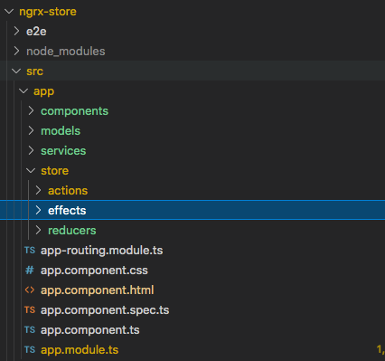
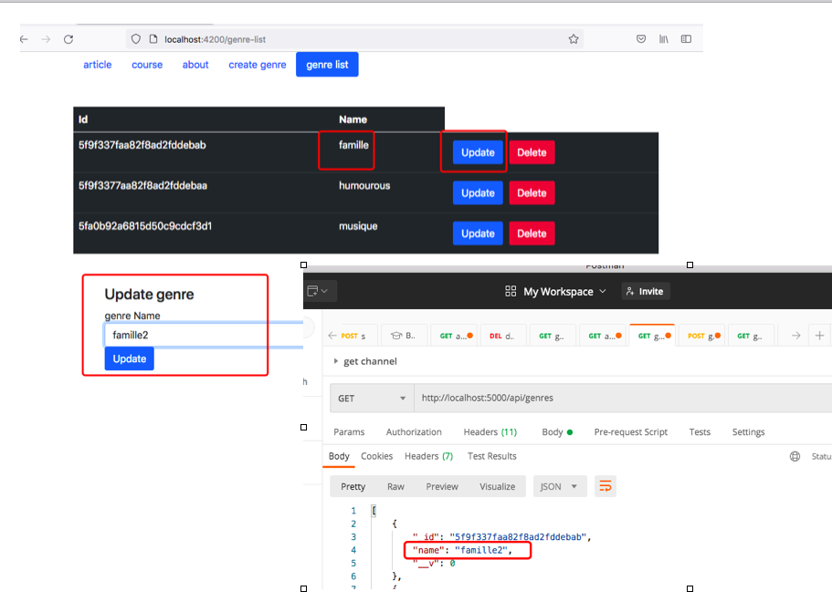
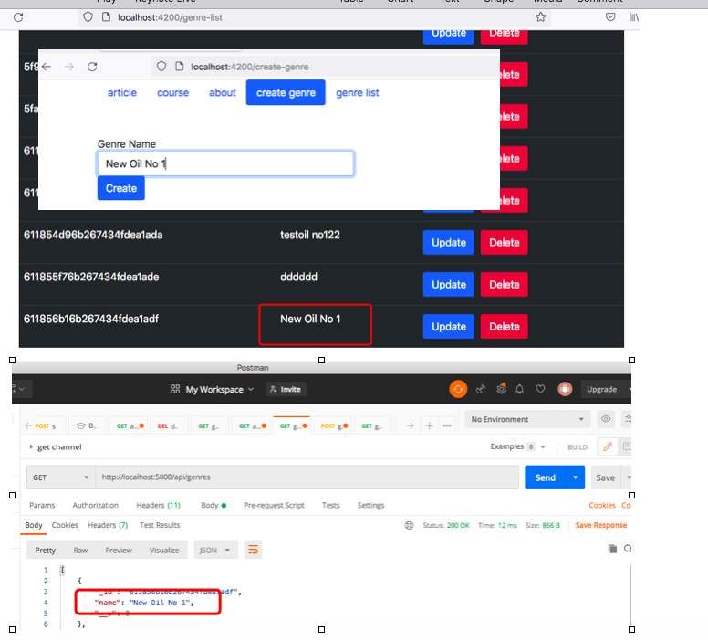
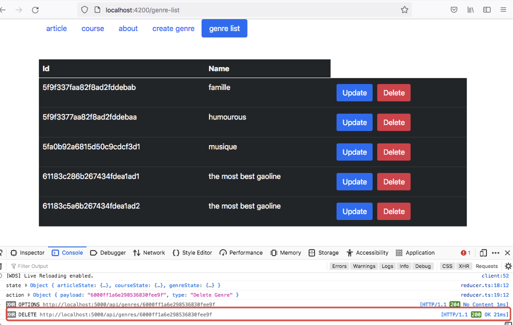

# build a CRUD application using @ngrx/store

## packages

- @ngrx/store : a state management tool. It is equivalent to Redux in React.
- @ngrx/effects: this package provide a way to interact with external resources such as fetching data or long-runing tasks.
- ngrx website:[ngrx.io](https://ngrx.io/guide/effects)

- npm i @ngrx/store @ngrx/effects -save

## steps

- define models

- define actions

- define states

  - app specific state + feature specific state

- define reducers, include

  - feature specific reducer
  - feature specific selector
  - reducers: ActionReducerMap

- modify app.module.ts

  - imports: StoreModule.forRoot(reducers, { metaReducers }),

- use store in component

```
 courses: Observable<Course[]>;

  constructor(private store: Store) {
    this.courses = store.select(courseReducer.getCourses);
  }

    showJavaCourses() {
    this.store.dispatch(new fromActions.JavaCoursesAction());
  }
```

---

## CRUD 
take notes: 

- define service.ts
- define effects
- register effects in app.module.ts
- call store.dispatchAciton in component

  - component event--> effects ---> service--->(internet)-->backend database

- file structure

  - 

- CRUD Screenshot
    - update 
  >
    - add 
  > 
    - delete 
  > 
